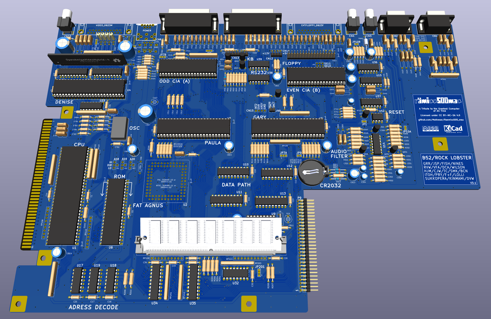
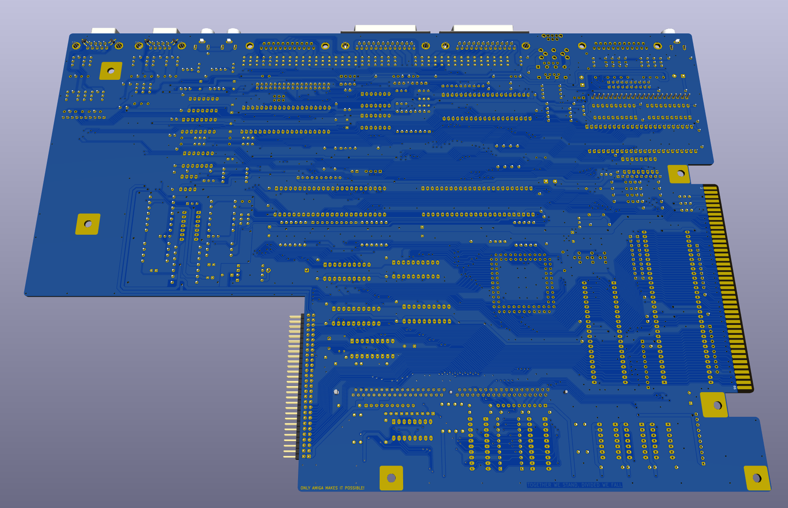
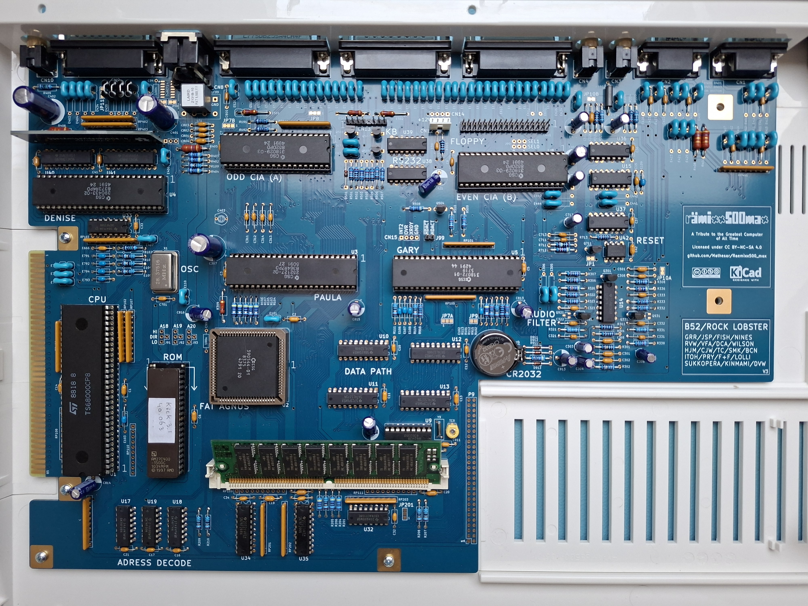

# Rämixx500_MAX

Rämixx500_MAX is an enhanced version of Sukkoperra's [Rämixx500](https://github.com/SukkoPera/Raemixx500), an Open Hardware remake of the Commodore Amiga 500+ mainboard, revision 8A.1.

## Features
The main feature of the Rämixx500_MAX compared to the original Rämixx500 is more RAM in the form of a 72pins 4Meg SIMM module that gives the Rämixx500_MAX 2Meg CHIP + 1.5Meg SLOW ram. Good working SIMM modules are much easier to source and more reliable than the DIP chips that were originally used in the A500+.

3.5 Megabytes of RAM is the maximum amount an A500+ can use without attaching an accelerator, hence the name Rämixx500_**MAX**.

All the new features of the Rämixx500_MAX are:

* **3.5 Megabytes of RAM**: Using a 72pin SIMM that is at least 4Meg in size.
* **Improved ESD Protection for the Joystick Ports**: The Rämixx500_MAX protects just the lines that go into the sensitive CIA and Paula chips but these lines are more rigorously protected by placing the ESD diodes right at the connectors.
* **Improved Hard Disk LED support**: This version accepts both active high and active low harddisk activity signals.
* **Even more Accurate Dimensions**: The floppy port should fit slightly better. (It already was very, very close in the original Rämixx500 though)
* **Less jumpers**: With the SIMM module, one always has max RAM in all banks, no need to jump around with JP2, JP3 and JP4 anymore.

## Ordering parts and building
Included with the gerbers is a BOM that contains most of the needed parts. Mouser part numbers are also included. 

The BOM and schematics reflect how I built my version. There are some options like buffered sync outputs and extra pullups that I did not use. If one wants these options then they will have to order the additional parts as well. 

Some more remarks regarding how I built my Rämixx500_MAX:

* I did not use sockets for all parts. I only used sockets for the second-hand / rare parts. All the standard logic IC's for example are not socketed. 
* For the 68000 the BOM specifies a high quality "machined" socket. This is done for reliable connection to a socketed accelerator. 
* The other sockets are standard "wiped" sockets. If one is planning to use, for example, an [A500_SD_PLUS](https://github.com/Mathesar/a500-sd-plus-controller) or a RGB2HDMI it is recommended to change the respective sockets (CIA / Denise) to machined sockets as well. This is because I have noticed that modern production wiped sockets get very loose if you insert something other that an IC in them.
* I have populated RP105, RP106 and RP107. This is unlike the original A500+ but these pullups help EPROM compatibility.
* In the BOM I have replaced the MC1488 and MC1489 with the functionally identical SN75C188N and SN75C189N.  
* In the BOM I have replaced the 74F139 with the CD74ACT139E.
* I did not populate the trapdoor connector P9 (not needed anymore).

Like said, the BOM will give you most of the parts needed. The missing parts are:

* **68000** (socket included in BOM)
* **Agnus** (socket included in BOM, only certain versions supported!)
* **Paula** (socket included in BOM)
* **Gary** (socket included in BOM)
* **Denise** (socket included in BOM)
* **2 CIA's** (socket included in BOM)
* **RTC U9** (socket included in BOM)
* **Trimmer capacitor TC-9** (for RTC)
* **Main oscillator X1** (PAL or NTSC)
* **Floppy DSUB connector**
* **Video DSUB connector**
* **Power connector**
* **SIMM module**
* **VIDIOT**

Any SIMM that is 4Meg or larger is supported. EDO and/or parity RAM is also supported.
There is one caveat though when using double sided SIMM's. As the RTC chip is sitting in a socket (recommended so it can easily be replaced) it might interfere with the memmory chips on the bottom of the SIMM. On my build it did not but it was a very close fit. Your mileage may vary.

See [Sukkopera's wiki here](https://github.com/SukkoPera/Raemixx500/wiki/Assembly-and-Installation) for more important information, especially on the Agnus version.

For the vidiot, one can use the [OpenAmigaVideoHybrid-04](https://github.com/Mathesar/OpenAmigaVideoHybrid-04) that I have also forked from Sukkoperra.

## Some important remarks and disclaimer
The SIMM socket sits higher that the original DIP chips. This can have implications for some accelerators or other add-ons that sit in the CPU socket. If one plans to use additional add-ons, please review carefully whether these will physically fit on the Rämixx500_MAX. Also see my remarks regarding IC sockets.

The active low harddisk activity LED input is only compatible with 5V devices.
The active high harddisk activity LED input is compatible with both 3.3V and 5V devices.

I have personally built and tested V3 of the Rämixx500_MAX. The current release is V3.1 that fixes some (very) minor issues. However, I have not built or tested V3.1 myself. So, build at your own risk.

## Releases
If you want to get this board produced, you are recommended to get the latest release rather than the current git version, as the latter might be under development and is not guaranteed to be working.

## License
The Rämixx500_MAX inherits the license of the The Rämixx500 by SukkoPera as quoted below:

> The Rämixx500 documentation, including the design itself, is copyright &copy; SukkoPera 2019-2021 and is licensed under the [Creative Commons Attribution-NonCommercial-ShareAlike 4.0 International License](https://creativecommons.org/licenses/by-nc-sa/4.0/).
> 
> This documentation is distributed *as is* and WITHOUT ANY EXPRESS OR IMPLIED WARRANTIES whatsoever with respect to its functionality, operability or use, including, without limitation, any implied warranties OF MERCHANTABILITY, SATISFACTORY QUALITY, FITNESS FOR A PARTICULAR PURPOSE or infringement. We expressly disclaim any liability whatsoever for any direct, indirect, consequential, incidental or special damages, including, without limitation, lost revenues, lost profits, losses resulting from business interruption or loss of data, regardless of the form of action or legal theory under which the liability may be asserted, even if advised of the possibility or likelihood of such damages.
> 
> This said, I would like this project to progress further. **If anyone would like to do major work on it but is discouraged to do so by the impossibility to exploit the work commercially, please get in touch with me**, I will grant you a private license which will allow you to do that.

## Thanks
- Commodore, for making the coolest machine ever.
- [SukkoPera](https://github.com/SukkoPera) for creating the amazing Rämixx500 and making it open source. Without him this would have never been possible.
- [PeteAU](https://eab.abime.net/member.php?u=58900) for designing an A500 trapdoor RAM expansion and gary adapter. His design inspired me to give the Rämixx500_MAX some additional RAM.

## Pictures

